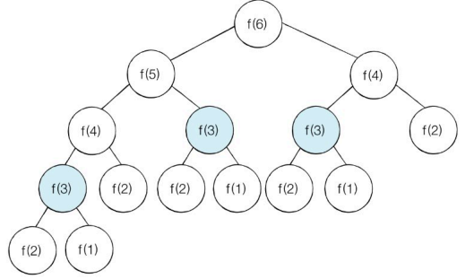

## 중복되는 연산을 줄이자

컴퓨터의 연산 속도외 메모리에는 물리적인 한계가 존재한다. 하지만 메모리 공간을 조금 더 추가적으로 활용을 한다면 연산 속도가 비약적으로 상승하는 방법이 있는데, 그것이 `다이나믹 프로그래밍` 기법 또는 `동적 계획법`이다.

다이나믹 프로그래밍으로 해결하기 좋은 대표적인 문제는 '피보나치 수열'이다. 피보나치 수열은 아래와 같은 점화식을 갖는다.

$a_{n+2} = f(a_{n+1}, a_{n}) = a_{n+1} + a_{n} (단, a_{1} = a_{2} = 1)$

이 점화식을 기반으로 피보나치 수열을 정의하면 아래와 같다.

$a_{n+2} = a_{n+1} + a_{n} (a_{1} = a_{2} = 1)$

프로그래밍에서는 이러한 수열(또는 연속된 많은 데이터)을 배열 또는 리스트로 표현할 수 있다. 피보나치 수열은 계속 이전 값으로부터 중첩되는 성질을 갖고 있으므로 재귀 함수를 통해 구현할 수 있다.

```python
def fibo(x):
	if x==1 or x==2:
		return 1
	return fibo(x-1) + f(x-2)

print(fibo(7))
```



하지만 이런 식으로 작성하면 시간복잡도가 약 $O(2^{N})$이 되는데, 이는 N=100인 경우 컴퓨터가 수백억 년간 연산을 수행해야 하는 규모이다.(1초에 1억 번 연산하는 경우)

그런데 피보나치 수열을 잘 살펴보면, 연산 과정에서 동일한 함수가 여러 번 호출되는 것을 볼 수 있다. N=4, 5, 6, 7.. 인 피보나치 함수는 항상 f(3)의 값을 연산해야 한다. 이러한 상황에서 다이나믹 프로그래밍을 활용하면 매우 간단하게 연산해낼 수 있다. 

다이나믹 프로그래밍을 사용하기 위한 조건은 아래와 같다.

1. **큰 문제를 작은 문제로 나눌 수 있어야 한다.**
2. **작은 문제에서 구한 정답이 큰 문제에서 구한 정답과 동일해야 한다.**

피보나치 수열은 이 조건을 만족하는 대표적인 예제이다. 여기서는 다이나믹 프로그래밍을 구현하는 방법 중 하나인 `메모이제이션(캐싱)`이라는 방식으로 해결해보자. 한 번 구한 정보를 리스트에 저장한 후, 다음에 동일한 정보를 연산해야 할 때 리스트에서 그 결과값을 꺼내오도록 구현하면 된다. 우리가 잘 아는 캐싱 기법과 정확히 동일한 전략이다.

> 참고로 엄밀히 말하면 메모이제이션 그 자체는 다이나믹 프로그래밍은 아니다. 단지 다이나믹 프로그래밍 구현을 위해 써먹을 뿐이다.

```python
memoizationList = [0] * 100

def fibo(x):
    if x==1 or x==2:
        return 1
    
    if memoizationList[x] != 0:
        return memoizationList[x]
    
    memoizationList[x] = fibo(x-1) + fibo(x-2)
    return memoizationList[x]

print(fibo(99))  # 218922995834555169026
```

그래서 이 말도 안되는 값의 연산을 1초도 안돼서 해낼 수 있게 된다.

큰 문제를 작은 문제로 해결하는 방식은 앞서 퀵 정렬의 분할 정복 알고리즘에서 본 전략이다. 하지만 분할 정복은 문제들이 서로에게 영향을 끼치지 않는 반면, 다이나믹 프로그래밍은 문제들이 그 다음 사건에 서로 영향을 끼친다는 명확한 차이점이 있다. 퀵 정렬은 일단 피벗 하나를 끝내서 자리를 잡게 하면, 이 피벗은 독립 사건과 같이 다음 퀵 정렬 연산에 영향을 미치지 않는다. 반면 피보나치 수열은 반드시 이전 연산값이 다음 연산에 영향을 미치는 점화식 구조를 갖는다.

다이나믹 프로그래밍을 적용하게 되면, 피보나치 수열의 경우 시간복잡도가 $O(2^{N})$에서 $O(N)$으로 성능이 비약적으로 좋아지게 된다. 앞에서 한 번 구한 결과값은 더 이상 연산할 필요가 없이 값을 불러오기만 하면 되기 때문이다. N=3, 4, 5... 각 N마다 연산을 한 번씩만 하면 된다.

```python
memoizationList = [0] * 100

def fibo(x):
    print('f(' + str(x) + ')', end=' ')

    if x==1 or x==2:
        return 1
    
    if memoizationList[x] != 0:
        return memoizationList[x]
    
    memoizationList[x] = fibo(x-1) + fibo(x-2)
    return memoizationList[x]

fibo(9)  # f(9) f(8) f(7) f(6) f(5) f(4) f(3) f(2) f(1) f(2) f(3) f(4) f(5) f(6) f(7)
```

이렇게 재귀 함수를 이용해서 다이나믹 프로그래밍을 구현하는 방법을 `탑다운(하향식)` 방식이라고 한다. 반면 반복문을 사용해서 다이나믹 프로그래밍을 구현하는 방법은 `바텀업(상향식)` 방식이라고 한다.

```python
memoizationList = [0] * 100

memoizationList[1], memoizationList[2] = 1, 1  # 인덱스 가독성을 위해 0번째는 버림
n = 99

for i in range(3, n+1):
    memoizationList[i] = memoizationList[i-1] + memoizationList[i-2]

print(memoizationList[n])  # 218922995834555169026
```

일반적으로 다이나믹 프로그래밍을 구현할 때는 재귀 함수의 성능 이슈(스택 오버플로우) 때문에 반복문 형식인 “바텀업” 방식으로 구현하게 된다. 이때 **바텀업 방식에서 사용되는 결과 저장용 리스트를 'DP 테이블'이라고 한다.** 다이나믹 프로그래밍 문제를 풀어보면 알겠지만, 이전 값으로부터 다음 값을 유추해야 하는 문제들이 대부분이라 바텀업으로 DP 테이블을 만들어서 푸는 것이 일반적인 형태이다.

메모이제이션은 상황에 따라 딕셔너리 자료구조로 구현할 수도 있다. 예컨데 연속적이지 않은 문제에 대한 해답을 제시해야 하는 경우에 딕셔너리 구조를 사용하면 고성능으로 구현할 수 있다. 하지만 코딩 테스트의 다이나믹 프로그래밍은 대체로 간단한 형태로 출제되기 때문에, 이 장에서 다루는 문제 수준만 풀 수 있어도 충분하다. 

## 코딩 테스트에서 다이나믹 프로그래밍 문제 푸는 팁

- 다이나믹 프로그래밍을 구현할 때는 반복문 형식의 바텀업 방식으로 구현하자. DP table을 완성하는 것을 목표로 해야 하며, 반드시 초기 조건을 DP table에 정의하고 점화식을 반복문 내에 넣어줘야 한다. 점화식 만들 때처럼, 끝 부분 언저리에서 이런 저런 경우의 수를 생각해보면서 이전 사건과 어떻게 이어질지 생각하면 의외로 쉽게 풀린다.
- 완전 탐색 알고리즘으로 접근했을 때 시간이 엄청 오래 걸리는 문제이면, 해당 문제는 다이나믹 프로그래밍 솔루션을 요구할 확률이 높다. 매 사건마다 반복적으로 연산되는 작은 부분들이 존재하는지 확인해보자.
- 재귀함수 형식의 탑다운 방식으로 구현해버린 경우, 메모이제이션을 활용하여 보완하는 방법이 있기는 하다. (하지만 가급적이면 바텀업으로 푸는 것이 좋음.)
- 입력 수의 범위가 매우 크면 그리디 또는 다이나믹 프로그래밍 유형일 가능성이 매우 높다.