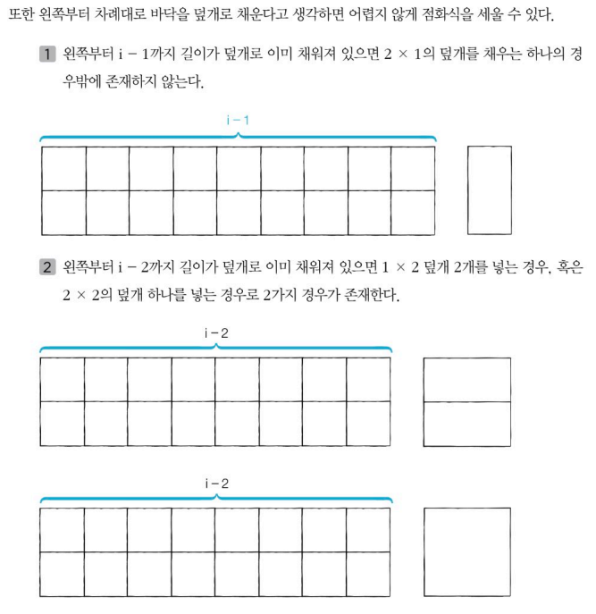

## 문제 정보

가로 길이가 n, 세로 길이가 2인 직사각형 형태의 얇은 바닥이 있다. 태일이는 이 얇은 바닥을 1\*2의 덮개, 2\*1의 덮개, 2*2의 덮개를 이용해 채우고자 한다. (세로 길이 \* 가로 길이)

이때 바닥을 채우는 모든 경우의 수를 구하는 프로그램을 작성하시오. 예를 들어 2*3 크기의 바닥을 채우는 경우의 수는 5가지이다.

### 입력

- 첫째 줄에 n이 주어진다. (1 이상 1000 이하)

### 출력

- 첫째 줄에 2*n 크기의 바닥을 채우는 방법의 수를 796,796으로 나눈 나머지를 출력한다.

### 예제 입력

```
3
```

### 예제 출력

```
5
```

## 풀이

초기 조건은 n=1일 때 1, n=2일 때 3.

그 이후부터는 이전 케이스에 대해 추가적인 경우의 수를 중첩시키는 것에 지나지 않는다. 너비가 2인 타일을 쓰는 경우 (i-2)번째 경우의 수를 중첩시키며, 너비가 1인 타일을 쓰는 경우 (i-1)번째 경우의 수를 중첩시킨다. 그것을 그림처럼 표현하면 아래와 같다.



이렇게 했을 때 점화식은 아래와 같다.

$a_{i} = a_{i-1} + a_{i-2}*2$

이를 코드화해서 그냥 바텀업 반복문 안에 넣은 뒤 DP 테이블을 계속 채워나가면 끝이다. 

여기서 의문을 품을 수 있다. 2*1 덮개를 연속으로 두면 2*2 덮개가 되므로 3배를 곱해야 하는 것 아니냐고. 하지만 이 케이스는 사실상 i-1번째 인 경우에 덮개를 덮는 경우가 두 번 연속으로 이어지는 것과 같으므로 이미 i-1번째에서 경우의 수가 처리된 것과 마찬가지이다. 그러므로 이게 맞다.

```python
n = int(input())

dpTable = [0] * 1001
dpTable[1] = 1
dpTable[2] = 3

# 마지막에 2*2 타일을 설치하는 경우 : dpTable[i-2] 
# 마지막에 1*2 타일 2개를 설치하는 경우 : dpTable[i-2] 
# 마지막에 2*1 타일을 설치하는 경우 : dpTable[i-1] 
for i in range(3, n+1):
    dpTable[i] = (dpTable[i-2] * 2) + (dpTable[i-1])

print(dpTable[n] % 796796)
```

```java
import java.util.Scanner;

public class MainClass {
	
	public static void main(String[] args) throws Exception {
			
		Scanner sc = new Scanner(System.in);
		
		int n = sc.nextInt();
		
		int[] dpTable = new int[1001];
		dpTable[1] = 1;
		dpTable[2] = 3;
		
		for ( int i = 3; i < n+1; i++) {
			
			dpTable[i] = dpTable[i-2] * 2 + dpTable[i-1];
		}
		
		System.out.println(dpTable[n]);
		sc.close();
	}
}
```