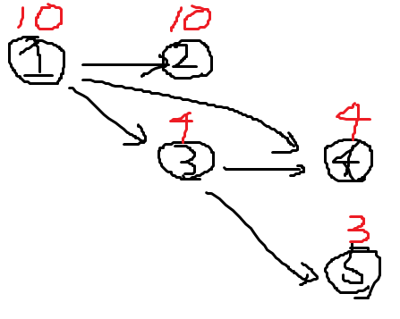

## 문제 정보

동빈이는 온라인으로 컴퓨터공학 강의를 듣고 있다. 이때 각 온라인 강의는 선수 강의가 있을 수 있는데, 선수 강의가 있는 강의는 선수 강의를 먼저 들어야만 해당 강의를 들을 수 있다. 예를 들어 '알고리즘' 강의의 선수 강의로 '자료구조'와 '컴퓨터 기초'가 존재한다면, '자료구조'와 '컴퓨터 기초'를 모두 들은 이후에 '알고리즘' 강의를 들을 수 있다.

동빈이는 총 N개의 강의를 듣고자 한다. 모든 강의는 1번부터 N번까지의 번호를 가진다. 또한 동시에 여러 개의 강의를 들을 수 있다고 가정한다. 예를 들어 N=3일 때, 3번 강의의 선수 강의로 1번과 2번 강의가 있고, 1번과 2번 강의는 선수 강의가 없다고 가정하자. 그리고 각 강의에 대하여 강의 시간이 다음과 같다고 가정하자.

- 1번 강의: 30시간
- 2번 강의: 20시간
- 3번 강의: 40시간

이 경우 1번 강의를 수강하기까지의 최소 시간은 30시간, 2번 강의를 수강하기까지의 최소 시간은 20시간, 3번 강의를 수강하기까지의 최소 시간은 70 시간이다. 

동빈이가 듣고자 하는 N개의 강의 정보가 주어졌을 때, N개의 강의에 대하여 수강하기까지 걸리는 최소 시간을 각각 출력하는 프로그램을 작성하시오.

### 입력

- 첫째 줄에 동빈이가 듣고자 하는 강의의 수 N이 주어진다. (1 <= N <= 500)
- 다음 N개의 줄에는 각 강의의 강의 시간과 그 강의를 듣기 위해 먼저 들어야 하는 강의들의 번호가 자연수로 주어지며, 각 자연수는 공백으로 구분한다. 이때 강의 시간은 100,000 이하의 자연수이다.
- 각 강의 번호는 1부터 N까지로 구성되며, 각 줄은 -1로 끝난다.

### 출력

- N개의 강의에 대하여 수강하기까지 걸리는 최소 시간을 한 줄에 하나씩 출력한다.

### 예제 입력

```
5
10 -1
10 1 -1
4 1 -1
4 3 1 -1
3 3 -1
```

### 예제 출력

```
10
20
14
18
17
```

## 풀이

각 과목의 선수 과목 순서를 반드시 지켜가며 정렬을 할 수 있어야 각 과목별 최소 이수 시간을 계산할 수 있다. 선수 과목은 방향성을 띄므로 방향 그래프로 표현할 수 있으며, 방향 그래프에서 방향성을 거스르지 않고 순서대로 나열하는 알고리즘은 '위상 정렬'이 있다. 다만 '시간' 이라는 노드 자체에 가중치 요소가 포함되어 있어, 위상 정렬 알고리즘 구현 시 이 요소를 함께 고려해서 문제를 풀어야 한다. 위상 정렬 알고리즘은 인덱스를 기반으로 구동되기 때문에, 인덱스에 기반하는 시간 테이블을 정의하여 각 노드 간 시간 가중치를 정의해두면 이전 노드의 이수 시간과의 단순합을 통해 이수 시간 합계를 구할 수 있다.

그런데 해설 코드에서 아래 코드에 max 함수가 왜 들어갔는지 의아할 수 있다.

```python
result[j] = max(result[j], result[selectNode] + timeTable[j])
```

문제에서 주어진 예제 상황에서는 불필요한 것은 사실이다. 단순히 위 코드를 max 함수의 두 번째 인자값으로 대체해도 문제는 풀린다. 하지만 이 코드가 유의미할 상황에 대해 설명하고자 한다.



주어진 예제 상황은 위 그림과 같다. 처음에 1번 노드가 진입차수가 0이므로 큐에서 제거하고자 할텐데, 그러면 1번 노드와 연결된 2, 3, 4번의 진입차수가 1씩 감소하게 된다. 2번과 3번 노드의 경우에는 무조건 이전 과목에서 자신의 이수 시간까지 합한 것이 반드시 크기에 저 max 함수의 사용은 무의미하다. 4번 노드도 처음에는 똑같다. 하지만 다음에 3번 노드가 큐에서 제거되는 시점에서는 달라진다. 주어진 문제 상황에서는 당연히 1번 노드의 이수 시간과 3번 노드의 이수 시간을 합친 것이 반드시 클 수밖에 없다. 하지만 만약 1 -> 3 -> 4 외에도 1 -> 2 -> 4 라는 루트가 있었다면? 그때는 1 -> 2 -> 4가 더 크다. 그런데 이 상황에서 저 max 비교함수 없이 큐에서 2번 노드가 먼저 뽑혔으면 이수 시간이 더 적은 1 -> 3 -> 4의 값으로 overwrite되는 문제가 발생한다. 그래서 저 max 비교 코드는 반드시 필요하다.

```python
from collections import deque
import copy

n = int(input())

inDegree = [0 for _ in range(n + 1)]

graph = [[] for _ in range(n+1)]
timeTable = [ 0 for _ in range(n+1)]  # 시간 정보는 테이블로 따로 빼준다. 인덱싱 매칭으로 접근하도록 함.
for i in range(1, n + 1):
    tempList = list(map(int, input().split()))
    timeTable[i] = tempList[0]
    for j in tempList[1:-1]:
        graph[j].append(i)
        inDegree[i] += 1

### 위상정렬
result = copy.deepcopy(timeTable)  # 각 과목 스스로는 최소한 자신의 이수 시간만큼의 시간이 소요된다. 깊은 복사를 통해 기존 시간 테이블과의 동기화 문제를 없앤다.
queue = deque()

for i in range(1, n+1):
    if(inDegree[i] == 0):
        queue.append(i)

while queue:
    selectNode = queue.popleft()
    for j in graph[selectNode]:
        result[j] = max(result[j], result[selectNode] + timeTable[j])
        inDegree[j] -= 1
        if(inDegree[j] == 0):
            queue.append(j)

### ---

for time in result[1:]:
    print(time)
```


```java

```